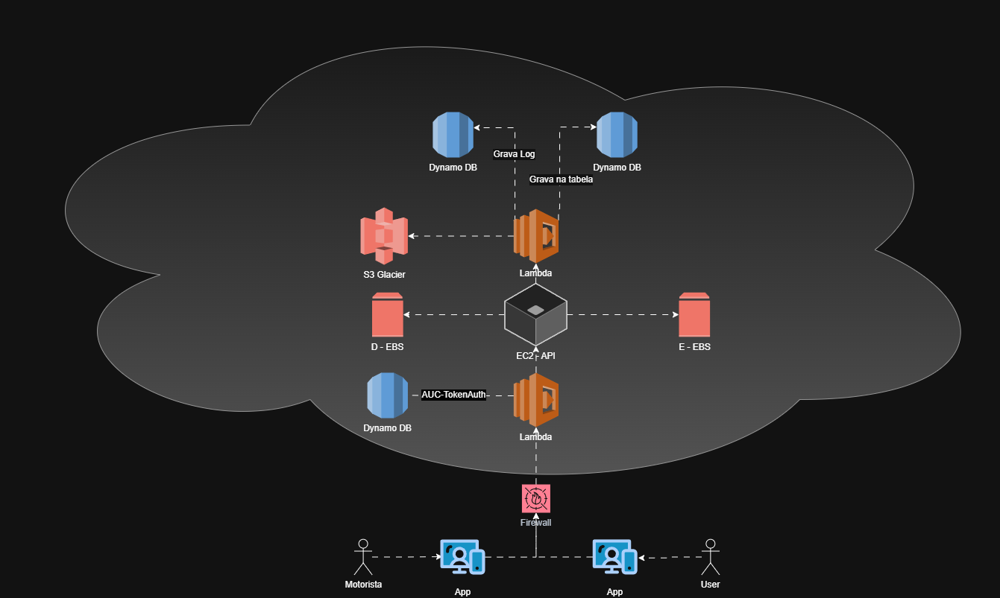

<h1 align="center"> Primeiro Desafio AWS DIO </h1>

Desafio, feito com estudos e tecnologias que aprendi no curso de AWS.

  <a href="#-tecnologias">Tecnologias</a>&nbsp;&nbsp;&nbsp;|&nbsp;&nbsp;&nbsp;
  <a href="#-projeto">Projeto</a>&nbsp;&nbsp;&nbsp;|&nbsp;&nbsp;&nbsp;
  <a href="#memo-licença">Licença</a>

  

 

  

## 🚀 Tecnologias

Esse projeto foi desenvolvido no [draw.io](https://www.drawio.com/)

## 💻 Projeto

O diagrama foi feito para realizar o gerenciamento de instâncias EC2 na AWS em uma empresa de viagens.
Onde o usuário/motorista entra no app, passa pelo firewall, faz a autenticação e entra na API, após isso a API busca as informações dos usuários no DB caso seja uma informação recorrente com menos de 90 dias, caso seja uma informação que passa disso, a consulta é direcionada para o S3 Glacier.
Dentro da API, o usuário faz a requisição de viagem e os motoristas próximos a recebem em cadeia por meio do seu raio de localização pulando a cada 15s até um motorista aceitar. E então quando o primeiro motorista aceita a corrida ela é fechada e o usuário é avisado.
Quando a corrida é encerra o processo é finalizado, realizando o último update da tabela no DB.

## :memo: Licença

Esse projeto está sob a licença MIT.
